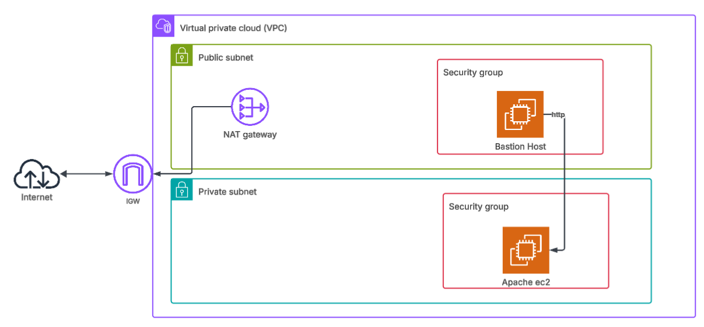
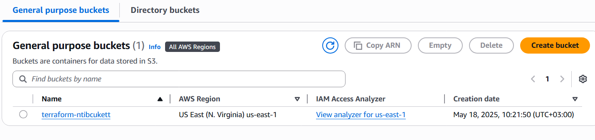
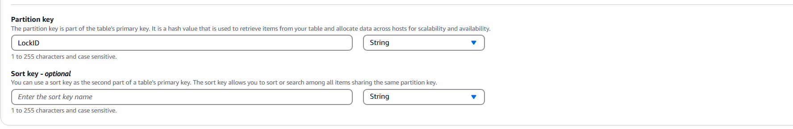
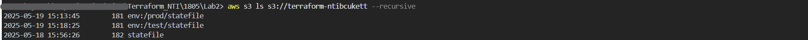

## Day2

### Objective: SSH on public server then curl on private server and see default html of apache, all values are variables



## Core Concepts and components

create manually an s3 bucket that will have the centralized state file to avoid mistaken deletion in other words manual creation ensures that the state bucket remains untouched even if you tear down all other resources, and note to make it in the same region  

#### Why Centralize Terraform State?
- Keeps infrastructure **state** safe and consistent across teams and automation pipelines.  
- Prevents issues like conflicting updates or loss of state if it were stored locally.  
- Enables state locking and versioning to avoid accidental overwrites and allow recovery by versioning.



---------------

#### The DynamoDB Lock Table

When two people run `terraform apply` at the same time, they both try to read and write to the same state file. The DynamoDB Lock Table ensures that only one apply/destroy/plan operation can happen at a time so when a person make an apply it locks and prevent anyone else to make an apply by adding a record into the dynamodb which represents who is the user making the apply.  

When creating the dynamodb note that the partial key must be named **LockID**  



Explanation of the Two Records Created in DynamoDB:  
- **Lock Record (LockID with state lock info)**: this is the actual lock record that prevents multiple concurrent Terraform operations on the same state file, while a user is running apply, plan, or destroy, this record exists and when the operation finishes **successfully**, this record is automatically removed but if left behind, it indicates that a previous operation crashed or didn’t release the lock.  
- **Checksum/Consistency Record**: Ensures that the state file hasn't been corrupted or manually modified outside of Terraform, using MD5 hash value (Digest)


```bash
terraform init --reconfigure
```
This command forces Terraform to reinitialize the backend configuration, even if it was previously set.  

---------------

**variables.tf**: defines the variables (names, types, descriptions, and optional defaults). Think of this as a "declaration" of inputs.  
**terraform.tfvars**: assigns values to those variables. This is where you provide the actual values used in the configuration.

there are ways to put the values of the variables and the priority from higher to lower is  
1. export in the terminal (environment variables)
2. terraform apply -var="cidr=10.0.0.0/16"
3. terraform apply --var-file = ./path-to-varsfile like: terraform apply --var-file = prod.tfvars
4. *.auto.tfvars
5. terraform.tfvars

If there are two files in the same priority it sorts them alphabitacly then execute them  

---------------

Note that each environment has her own statefile like production statefile is different testing statefile so you check which state file to use when applying 

```bash
terraform workspace new prod
terraform workspace new test
```
it created a new environment prefix (env) in the s3 that will have the environments so that each one has its own statefile  




```bash
terraform workspace show
terraform workspace list
terraform workspace select prod
terraform workspace delete prod
```
---------------

#### Some important commands

```
terraform apply --target=aws_instance.myinstance
```
Will plan and execute changes only for this resource and its dependencies, ignoring everything else defined in your `.tf` files. Used when you want to create, update, or destroy just one specific resource without affecting others like **resource is in a bad or unhealthy State or manual changes were made outside of terraform (Drift)**

```
terraform taint aws_instance.web_serverec2
```
Even if this resource (ec2) looks fine, I want you to DESTROY and RECREATE it the next time I apply. Used in situations where you need to force the recreation of a resource, even though its configuration hasn’t changed.


```
terraform fmt
```


```
terraform state pull > statefile.txt 
terraform state list
terraform state show aws_subnet.mysubnet      
```

```
terraform state rm aws_subnet.mysubnet
```
It removes the resource from the Terraform state which means it will no longer track or manage that resource but does NOT delete the actual AWS resource (in this case, the subnet remains in AWS)  

---

    if you created something in the aws management console or it already exists and you want terraform to manage it. First you add it in the main.tf then you give it to terraform by the following command with its id

```bash
terraform import aws_vpc.manual vpc-id
```
so **import** adds the service created manual into terraform state file


